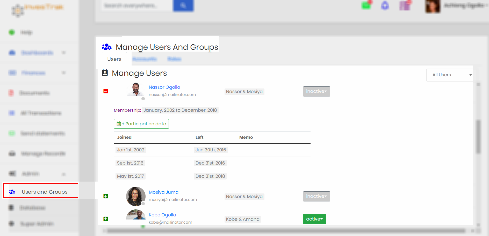

#	Admin Section
!>This section is only accessible to the Administrator. It should be used with care to ensure data is not lost or corrupted.

##	Manage Users and groups
This section is used to administer the records of the fund members. There are several Tabs at the administrator’s disposal.

###	Users
The `Users` Tab is used to edit an individual member’s profile. It can be used to add new users or edit such records as Name, email address, account, profile image or address.

!>**Note** The email address is also used as the login credential. While it can be changed, care should be exercised to avoid confusion. Also ensure there is no other member with duplicate email address.

#### Activate or disable Users
To login and use the platform a user's login needs to be active. All user accounts have one of the following statuses:
  - `Active` - This is the status that all members who login to the system will normally have. The status is denoted by the colour green.
  - `InActive` - This status is set automatically by the system based on the members `Participation date` when the user is not actively contributing. Members with this status can still login to the system. The admin cannot manually set an account to this status. The status is denoted by the colour gray.
  - `Pending` - When a member initially registers into the system the user's account is saved with this status. They will be unable to login until the administrator changes the status to `Active`. The admin cannot manually set an account to this status. The status is denoted by the colour orange.
  - `Disabled` - When a user leaves the Administrator can disable the user's login by changing the status to `Disabled`. The member will be unable to login until the administrator changes the status to `Active`. The status is denoted by the colour red.

To activate a user whose status is `pending` or `disabled` do the following:
  - Click on the users `Status` button in the `Manage Users` page.
  - Select the `active` (or set to `disabled` if the account is `pending` or `active`).
  - Confirm when prompted.

?> **Note** You cannot use the `status` button to change a user's status from something else to `pending` or `inactive`. The `pending` status is reserved for the system. A newly signed up user will automatically be marked as `inactive`, until the admin changes this status. Additionally the `inactive` status is automatically determined based on the `participation date` records that have been entered for a user. If there are no `participation date` records that include the current date, the member's account is automatically marked as `inactive`.

|  Select Status             |  Confirm change |
  :-------------------------:|:-------------------------:
 | 

####	Participation dates

!> **Note** It is important that the Administrator accurately records all members' `Participation Dates` so that arrears and dues can be calculated correctly.

`Participation Dates` provide exact date intervals for which a specific member is expected to be an active, dues paying member of the fund. By recording exact date ranges the system can then calculate how much everyone is expected to pay and from that determine arrears for each account. Add as many date ranges as necessary to fully describe the members dates of participation , especially if the member had many gaps in their membership.

#####	Add Participation dates
To add a participation date click on the `+ Participation date` button under a member's record.

In the `Create Participation Date` page, provides the following information:

- `Member` – This is pre-selected based on the member record under which the add button was clicked. It can be changed.
- `Date Joined` – Enter the date joined or the date rejoined after the member had previously left.
- `Date Left` – This is blank if the member is active under this date range.
- `Memo` – Add any additional information regarding the participation date record.

?> **Note** If there are no participation date records that include the current date, the member's account will be marked as `inactive`.

###	Accounts
All dues paying members of the fund should be associated with an account. An account is the entity to which  contributions, loans, and loan payments to or from the fund are attributed to. An account can contain one or more users. Although expected contributions depend on each individual in an account, the amounts are reflected against the account.

#### Add Account
The `+ New Account` button at the top of the screen is used to add a new account to the system.

The `Manage Accounts` page displays a table listing all accounts displaying the following two columns:

- `Account title` - he name of the accounts
- `Lump sum required` -  a check-box (true or false) that indicates whether the system should expect a lump sum payment from the account.

Each account record also displays a collapsible button that provides more information and capabilities i.e.

#### Add member to Account
`+ Member` button under the respective account is used to add  a member to an account. A member can only be assigned one account.

#### Set Lumpsum required buttons
This is displayed as a switch to turn on or off the requirement for a lump sum payment.

#### Remove member from account
A member can be removed from an `Account` using the `Red Trash can`  button next to the member record.

###	Roles
`Roles` are synonymous to User groups. They are used to easily place login accounts into groups for which appropriate permissions can be assigned.

!> **Note** The existing `Roles` should not be deleted as the application logic requires them to ensure access to different resources and pages is provided correctly

####	Add Role Membership
`+ Member` button under the respective role is used to add  a roles for individual member login. A member can be assigned one or more  roles.

##	Manage database
This section provides a view that allows the administrator to access and manipulate records in the database. It is very useful for examining, changing or deleting records when the front end pages have a problem. It should be used with care and a full understanding of the data schema.

##	Super Admin
This section is used by the administrator to display the native system back-end interface.

