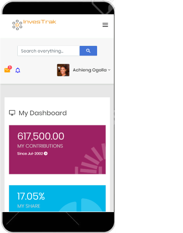

#	The Dashboards Area
Use the dashboard area to view numbers, tables and graphs that provide a summary of fund in general or for the account of the currently logged in member.

##	Fund Dashboard

<!-- tabs:start -->
#### **Desktop**

#### **Mobile**

<!-- tabs:end -->

Under the Fund Dashboard area, members can view the following:

- `Cash Position` – a card that displays how much money the fund has in the hand. It also displays a small cash position trend chart (24 months).
- `Investments` – a card that displays how much money the fund has in investments. It also displays chart that shows the investment value for the last several months.
- `Loans` – a card that displays total outstanding loans from members.
- `Arrears` – a card that displays total outstanding Contributions from members. It also displays what percentage this is of the Total fund value.
- `Account status` – A table that with breakdown of each account showing respective contributions, progress (percentage of expected contributions that have been fulfilled), arrears and lumpsum payments.

## My Dashboard
My dashboard area provides a summary of the accounts focused on the respective user’s account.
<!-- tabs:start -->
#### **Desktop**

#### **Mobile**

<!-- tabs:end -->
Under the My Dashboard area, members can view the following:
  - `My Contributions` – a card that displays the contributions made by the respective account of the logged in member. It also displays when the contributions began.
  - `My Share` – a card that displays the percentage of the individual account’s contribution much money the fund has in the hand. Note that a member can only see their and not that of other accounts.
  - `My Arrears` – a card that displays the respective account’s outstanding contributions. It also displays how many years and months the account is ahead or behind by.
  - `My Loans` – a card that displays total amount of loans outstanding for the respective account. It also displays how many outstanding loans the member has.
  - `My Contributions Trend` – a timeline graph that displays the monthly trend of contribution made by the respective account.
