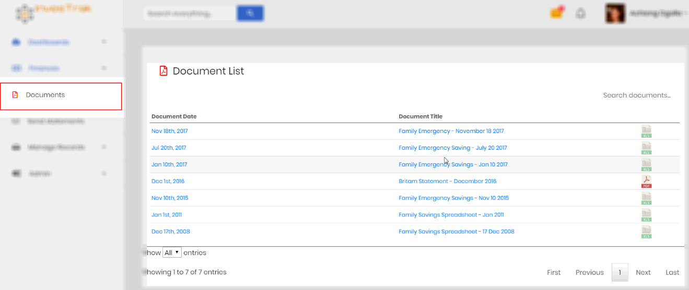
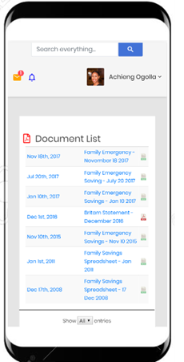
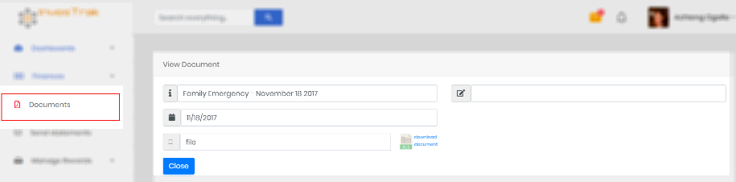
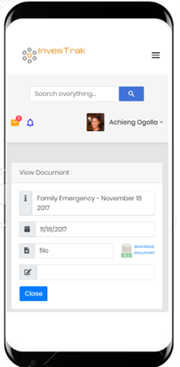

# Documents
This page displays a table which lists the documents clubs relevant documents, such as meeting minutes and bank statements. The `company secretary` or any `committee member` will be able to add and remove documents from this section. All members are able to view & download any company documents posted here.

<!-- tabs:start -->
#### **Desktop**
 

 #### **Mobile**
 
<!-- tabs:end -->

Clicking on the document record opens the `View Document` page to display the document details.

<!-- tabs:start -->
#### **Desktop**

#### **Mobile**

<!-- tabs:end -->

Details of the loan record include:

- `Document Title` – A descriptive title by which the document can be identified.
- `Document Date` – The date the Document was uploaded.
- `File Upload` – If the user has permission this is the button to upload the document file.
- `Memo` – Any additional information regarding the transaction.
