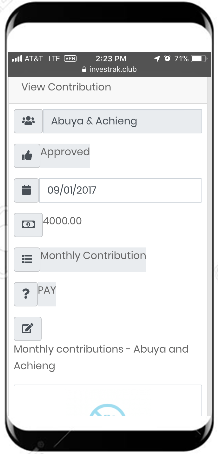
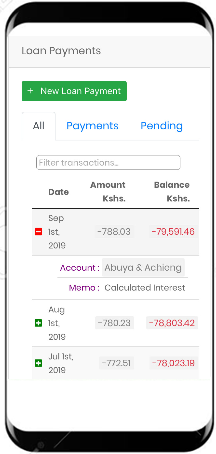

#	Finances Area
Under the Finances section, users can view the following:
- Member’s Contributions.
- Member’s loans.
- Fund Transactions.
- Investments.
- Company documents.

##	My Contributions
This page displays a table which lists the details of contributions made your account.

<!-- tabs:start -->
#### **Desktop**

#### **Mobile**

<!-- tabs:end -->
Clicking on a contribution record opens the `View contribution` page to display the contribution details.
<!-- tabs:start -->
#### **Desktop**

#### **Mobile**

<!-- tabs:end -->

Details of the Contribution record are:
- `Account` – the name of the account associated with the contribution payment.
- `Approval` – used by the treasurer to approve/reject a record entered by Member.
- `Date` – the date the payment was made.
- `Amount` – the amount paid.
- `Category` – the category of the payment e.g. Monthly Contribution or Lump sum payment.
- `Type` – whether the transaction was a payment or receipt.
- `Memo` – any additional information regarding the transaction.
- `Allocations` – used to allocate portion of payments to different months. This is useful if one large payment was made from an account to be distributed for several months.
- `Image` - used to attach image of banking receipt (useful for approval).

### Add Contributions
If you have deposited your contributions to the bank, You can add your own contributions record using the `New Contribution` button on this page.
The record will be marked as `Pending` by default until the `Treasurer` edits and approves the record.
In the `Create Contribution` page, provide the following information:

- `Date` – Select the date the payment was made.
- `Amount` – Enter the amount paid.
- `Memo` – Add any additional information regarding the transaction.
- `Attachment` - use the `Choose File` button to upload an image of the banking receipt. This will be used as proof for the `Treasurer` to approve the payment record.

?>Contribution records with a status as `Pending` will not be included in a members total contributions sum until the `Treasurer` marks it as `Approved`.

##	My Loans
This page displays a table which lists the displays the details of loans given to the account.

<!-- tabs:start -->
#### **Desktop**

#### **Mobile**

<!-- tabs:end -->

Clicking on a loan record opens the `Edit Loan` page to display the loan details.
<!-- tabs:start -->
#### **Desktop**

#### **Mobile**

<!-- tabs:end -->
Details of the loan record include the following:

- `Account` – the name of the account the loan was disbursed to.
- `Loan Date` – The date the loan was disbursed.
- `Loan Amount` – The amount disbursed.
- `Interest Type` – Simple or Compound interest.
- `Interest(%APR)` – Annual Percentage Rate calculated monthly.
- `Start payment` – When the first payment is expected.
- `Period` – How many months to complete the payments (useful in calculating estimated monthly repayments).
- `Memo` – Any additional information regarding the transaction.

The following are  automatically:
- Loan status `(estimated monthly repayments)` – Estimated Monthly Repayments based on the interest rates and payment periods.
- Loan status `(outstanding)` – Outstanding loan based on the calculated interest first day payment is expected.

An additional section is displayed with the following details:

- `Payments` – A list of payments made, and monthly interest calculated for the loan. The records can be viewed from several tabs - `All` to display all transactions including payments and calculated transactions, `Payments` to display just payments without calculated interest `Pending` to display only the payments that are still marked as pending.

### Add Loan Payment
If you have deposited your a loan payment to the bank, you can add your own contributions record using the `New Loan Payment` button on this page.

<!-- tabs:start -->
#### **Desktop**

#### **Mobile**

<!-- tabs:end -->

In the `Create Loan Payment` page, provide the following information:

- `Date` – Select the date the payment was made.
- `Amount` – Enter the amount paid.
- `Memo` – Add any additional information regarding the transaction.
- `Attachment` - use the `Choose File` button to upload an image of the banking receipt. This will be used as proof for the `Treasurer` to approve the payment record.

Click on the `Create Payment` button to save save the record.

The record will be marked as `Pending` by default until the `Treasurer` edits and approves the record.

?>Loan payment records with a status as `Pending` will not be included in a members total loan payments sum until the `Treasurer` marks it as `Approved`.

## Fund Transactions
This page displays a table which lists the details of transactions carried out by the Fund (income or Expense).  

<!-- tabs:start -->
#### **Desktop**

#### **Mobile**

<!-- tabs:end -->

Clicking on a Fund Transaction record opens the `View Fund Transaction` page to display the fund transaction details.

<!-- tabs:start -->
#### **Desktop**

#### **Mobile**

<!-- tabs:end -->

Details of the fund transaction  record include:
- `Activity Date` – The date the of the fund transaction.
- `Category` – Expense or Income.
- `Amount` – The transaction amount.
- `Memo` – Any additional information regarding the transaction.

##	Investments
This displays investment records for the fund.
<!-- tabs:start -->
#### **Desktop**

#### **Mobile**

<!-- tabs:end -->
Clicking on an Investment record opens the `Edit Investment` page to display the investment details.
<!-- tabs:start -->
#### **Desktop**

#### **Mobile**

<!-- tabs:end -->

Details of the investment record include:
- `Open Date` – The date the Investment was opened.
- `Investment Active` - a check-box that indicates whether or not the investment is active.
- `Close Date` – The date the Investment was closed (if no longer active).
- `Investment Funding` – Total amount that has been invested into the Investment.
- `Investment Value` – The total amount that the investment is worth (including gains and losses).
- `Memo` – Any additional information regarding the transaction.
- `Investment Transactions` – a table grid that display individual invest transactions including initial funding, losses gain etc.

## All Transactions

?>This is a read-only page. It consolidates transactions from the various types of transactions to create a statement of all activity in the fund.

This page is used for reconciliation. Practically it should be comparable to the bank statement. It combines and lists all transactions in chronological order with a running total. It is useful to compare with bank statements for determining cash position.

The page displays a table with columns follows:

- `Month` - All months listed chronologically since the beginning of the club's financial transactions.
- `Balance` - A running total that takes into account the previous months balance as well as all the transactions for the respective month.

Each month row has an `expand/collapse` button  that can be used to show or hide transactions individual transactions for that month. When the month row is expanded the corresponding records are displayed with the following columns:

- `Date` - The date that the transaction happened.
- `Detail` - a description for the particular transactions.
- `Amount` - The transaction amount. Money in is displayed as green while money out is displayed as red and in negative.
- `Balance` - The running balance taking into account all previous transactions.

Additionally the page contains the following:
- `Search transactions` - a search box is also provided to allow you to filter a specific transaction you may be looking for. When you type into the box the table is automatically filter to display just the transactions containing the word being searched.

?>Note that when more than one word is entered into search box, the table displays records corresponding to **any** of the search words.
