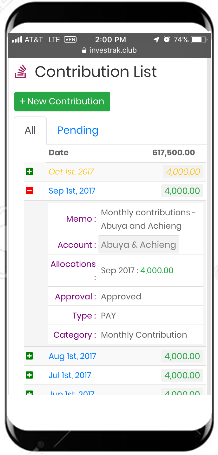
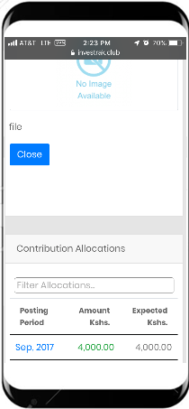
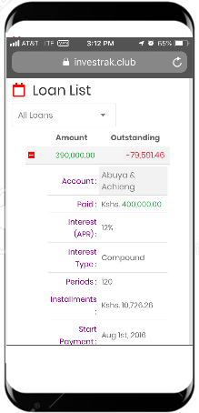
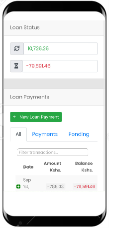

#	Finances Area
Under the Finances section, users can view the following:
- Member’s Contributions.
- Member’s loans.
- Fund Transactions.
- Investments.
- Company documents.

##	My Contributions
This page displays a table which lists the details of contributions made your account.

<!-- tabs:start -->
#### **Desktop**

#### **Mobile**

<!-- tabs:end -->
Clicking on a contribution record opens the `View contribution` page to display the contribution details.
<!-- tabs:start -->
#### **Desktop**

#### **Mobile**

<!-- tabs:end -->

Details of the Contribution record are:
- `Account` – the name of the account associated with the contribution payment.
- `Date` – The date the payment was made.
- `Amount` – the amount paid.
- `Category` – Category of the payment e.g. Monthly Contribution or Lump sum payment.
- `Type` – whether the transaction was a payment or receipt.
- `Memo` – Any additional information regarding the transaction.
- `Allocations` – used to allocate portion of payments to different months. This is useful if one large payment was made from an account to be distributed for several months.

##	My Loans
This page displays a table which lists the displays the details of loans given to the account.

<!-- tabs:start -->
#### **Desktop**

#### **Mobile**

<!-- tabs:end -->

Clicking on a loan record opens the `Edit Loan` page to display the loan details.
<!-- tabs:start -->
#### **Desktop**

#### **Mobile**

<!-- tabs:end -->
Details of the loan record include the following:

- `Account` – the name of the account the loan was disbursed to.
- `Loan Date` – The date the loan was disbursed.
- `Loan Amount` – The amount disbursed.
- `Interest Type` – Simple or Compound interest.
- `Interest(%APR)` – Annual Percentage Rate calculated monthly.
- `Start payment` – When the first payment is expected.
- `Period` – How many months to complete the payments (useful in calculating estimated monthly repayments).
- `Memo` – Any additional information regarding the transaction.
- `Loan status (estimated monthly repayments)` – Estimated Monthly Repayments based on the interest rates and payment periods.
- `Loan status (outstanding)` – Outstanding loan based on the calculated interest first day payment is expected.
- `Payments` – A list of payments made, and monthly interest calculated for the loan.

## Fund Transactions
This page displays a table which lists the details of transactions carried out by the Fund (income or Expense).  

<!-- tabs:start -->
#### **Desktop**

#### **Mobile**

<!-- tabs:end -->

Clicking on a Fund Transaction record opens the `View Fund Transaction` page to display the fund transaction details.

<!-- tabs:start -->
#### **Desktop**

#### **Mobile**

<!-- tabs:end -->

Details of the fund transaction  record include:
- `Activity Date` – The date the loan was disbursed.
- `Category` – Expense or Income.
- `Amount` – The transaction amount.
- `Memo` – Any additional information regarding the transaction.

##	Investments
This displays investment records for the fund.
<!-- tabs:start -->
#### **Desktop**

#### **Mobile**

<!-- tabs:end -->
Clicking on an Investment record opens the `Edit Investment` page to display the investment details.
<!-- tabs:start -->
#### **Desktop**

#### **Mobile**

<!-- tabs:end -->

Details of the investment record include:
- `Open Date` – The date the Investment was opened.
- `Close Date` – The date the Investment was closed (if no longer active).
- `Funding` – Total amount that has been invested into the Investment.
- `Current` – The total amount that the investment is worth (including gains and losses).
- `Memo` – Any additional information regarding the transaction.
- `Investment Transactions` – a table grid that display individual invest transactions including initial funding, losses gain etc.
