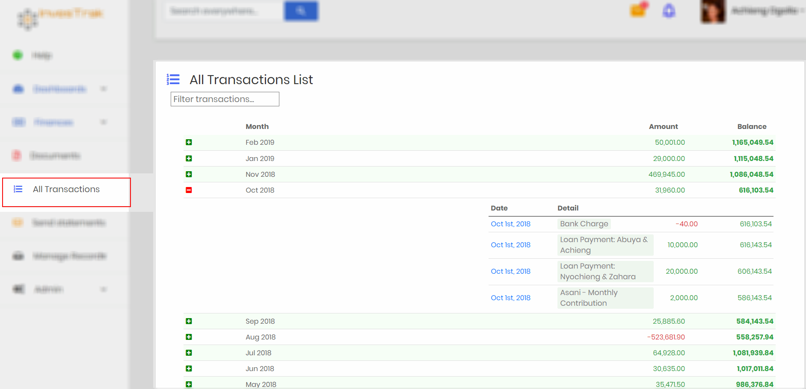

# Manage records

?> As a committee member, you’ll have an additional area labeled `Manage Records`. In this section, you’ll have several additional links to allow administration of the site. Menu links in this area are visible depending of the access permission of the logged in member. The `Admin`, `Treasurer` or member with the permission `finance_write` will be able to add, edit and remove transactions. All other committee members or member with the permission `finance_read_all` will be able to view all transactions. The sections will be `View All Records` instead.

## Manage Contributions

!>Editing, adding or deleting contribution records can only be done by the `Admin`, `Treasurer` or member with the permission `finance_write`. Other committee members or member with the permission `finance_read_all` can view all contribution records in read-only mode.

This page used to Add, Edit or Delete records for contributions made by members. The page is similar to the [My Contributions](finances.md#my-contributions) page with a few extra buttons - `New Contribution` and `Delete` for each record - which allows for managing the records.

## Manage Loans

!>Editing, adding or deleting loan records can only be done by the `Admin`, `Treasurer` or member with the permission `finance_write`. Other committee members or members with the permission `finance_read_all` can view all contribution records in read-only mode.

This page used to Add, Edit or Delete records for loans disbursed to members. The page is similar to the [My Loans](finances.md#my-loans) page with a few extra buttons - `New Loan` and `Delete` for each record - which allows for managing the records.

## Manage Fund Transactions

!>Editing, adding or deleting fund transaction records can only be done by the `Admin`, `Treasurer` or member with the permission `finance_write`.

This page is used to Add, Edit or Delete fund transactions. The page is similar to the [Fund Transactions](finances.md#fund-transactions) page with a few extra buttons - `New Fund Transaction` and `Delete` for each record - which allows for managing the records.

## Manage Investments

!>Editing, adding or deleting investment records can only be done by the `Admin`, `Treasurer` or member with the permission `finance_write`.

This page is used to Add, Edit or Delete Investment records. The page is similar to the [Investments](finances.md#manage-investments) page with a few extra buttons - `New Investment` and `Delete` for each record - which allows for managing the records.

## Manage Documents

!>Editing, adding or deleting documents can only be done by the `Admin`, `Treasurer` or member with the permission `finance_write`.

This page is used to Add, Edit or Delete document records. The page is similar to the [Documents](documents.md) page with a few extra buttons - `New Document` and `Delete` for each record - which allows for managing the records.

## Statement

!>This is a read-only page. It can only be viewed by the `Admin`, `Treasurer` or member with the permission `finance_write`.

This page is used for reconciliation. Practically it should be comparable to the bank statement. It combines and lists all transactions in chronological order with a running total. It is useful to compare with bank statements for determining cash position.

The page displays a table with columns follows:

- `Month` - All months listed chronologically since the beginning of the club's financial transactions.
- `Balance` - A running total that takes into account the previous months balance as well as all the transactions for the respective month.

Each month row has an expand/collapse button that can be used to show or hide transactions individual transactions for that month. When the month row is expanded the corresponding records are displayed with the following columns:

- `Date` - The date that the transaction happened.
- `Detail` - a description for the particular transactions.
- `Amount` - The transaction amount. Money in is displayed as green while money out is displayed as red and in negative.
- `Balance` - The running balance taking into account all previous transactions.

Additionally the page contains the following:
- `Search transactions` - a search box is also provided to allow you to filter a specific transaction you may be looking for. When you type into the box the table is automatically filter to display just the transactions containing the word being searched.

?>Note that when more than one word is entered into search box, the table displays records corresponding to **any** of the search words.
