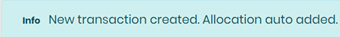
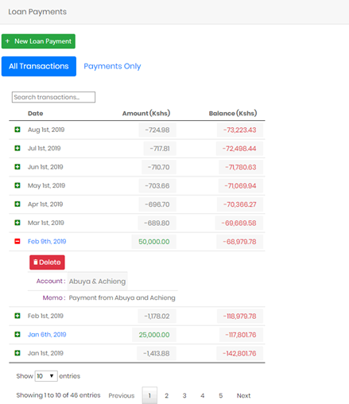

# Manage records

?> As a committee member, you’ll have an additional area labeled `Manage Records`. In this section, you’ll have several additional links to allow administration of the site. Menu links in this area are visible depending of the access permission of the logged in member. The `Admin`, `Treasurer` or member with the permission `finance_write` will be able to add, edit and remove transactions. All other committee members or members with the permission `finance_read_all` will be able to view all transactions. The sections will be `View All Records` instead.

## Manage Contributions

!>Editing, adding or deleting contribution records can only be done by the `Admin`, `Treasurer` or member with the permission `finance_write`. Other committee members or member with the permission `finance_read_all` can view all contribution records in read-only mode.

This page used to Add, Edit or Delete records for contributions made by members.

The page is similar to the [`My Contributions`](finances.md#my-contributions) page with a few extra buttons i.e. The `New Contribution` button at the top of the page and the `Delete` button for each record - which allows for managing the records. These are explained in more detail below.

### Add Contributions
You can add contributions using the `New Contribution` button on this page. In the `Create Contribution` page, provide the following information:

- `Account` – Select the name of the account to be associated with the contribution payment.
- `Date` – Select the date the payment was made.
- `Amount` – Enter the amount paid.
- `Category` – Select the category of the payment e.g. Monthly Contribution or Lump sum payment.
- `Type` – Select whether the transaction was a payment or receipt.
- `Memo` – Add any additional information regarding the transaction.

?>As soon as the new contribution record is saved, it allocates the total contribution amount to the month associated with the date of the contribution. `Allocations` are useful if one large payment was made from an account, that is to be distributed for several months. The single payment is saved as one contribution. `Allocations` are then used to apportion the single contribution payment to different months.

### Edit Contributions
From the `Contributions List` page, click on a contribution record to edit it. The `Edit Contribution` page allows you to edit the records described above in the `Add contributions` page.

The `Edit Contribution` page contains an additional section, where the `Allocations Table` will displayed.

- `New Allocation`button - Used to create a new allocation.
- `Search Allocations` box - used to search for a specific allocation.
- `Allocations Table` - that lists all allocations associated with the contribution. The table shows the following columns.

  - `Posting Period` - A Year-Month combination to determine the month to be associated with the allocation.
  - `Amount` - Amount to be allocated to this
  - `Expected` - This is an automatically calculated amount. The system determines the expected amount based on the monthly expected amount for that particular month as well as the number of active members associated with the respective account.

Click on an existing `Allocation` record on the table to edit it. An `Allocation` record can be deleted using the `Red Trash can`  button next to the record.

!> When creating multiple allocations, ensure that the sum of all allocations equals the contribution amount.

### Delete Contributions
!> Deleting a contribution record will also delete any associated records (like allocations). Use caution.

Each contribution record has an `expand/collapse` button , that provides additional information on the record. When the record is expanded, it displays a `Delete` button which you can use to delete the contribution record.

## Manage Loans

!>Editing, adding or deleting loan records can only be done by the `Admin`, `Treasurer` or member with the permission `finance_write`. Other committee members or members with the permission `finance_read_all` can view all contribution records in read-only mode.

This page used to Add, Edit or Delete records for loans disbursed to members. The page is similar to the [`My Loans`](finances.md#my-loans) page with a few extra buttons i.e. The `New Loan` button at the top of the page and the `Delete` button for each record - which allows for managing the records. These are explained in more detail below.

### Add New Loan
You can add new loans using the `New Loan` button on `Loan List` page. In the `Create Loan` page, provide the following information:

- `Account` – The name of the account that the loan is to be disbursed to.
- `Loan Date` – The date the loan is to be disbursed.
- `Loan Amount` – The amount to be disbursed.
- `Interest Type` – Should the system charge Simple or Compound interest?
- `Interest(%APR)` – The Annual Percentage Rate to be used to calculated monthly interest.
- `Start payment` – When the first payment is expected (this affects when the interest calculations begin).
- `Period` – How many months to complete the payments (useful in calculating estimated monthly repayments).
- `Memo` – Any additional information regarding the transaction.

### Edit Loan

From the `Loan List` page click on a loan record to edit it. The `Edit Loan` page allows you to edit the records described above in the `Add New Loan` section. This page contains an additional sections, where the `Loan status` section and `Loan Payments` table are displayed.

The `Loan status` section displays the following  automatically calculated fields:

- `Calculated monthly payments` – Estimated monthly repayments based on the interest rates and payment periods.
- `Outstanding Loan Amount` – Outstanding loan based on the calculated interest first day payment is expected.

The  `Loan Payments` section is displayed with the following details:

- `New Loan Payment` button – used to create a new loan payment.
- `Search Transactions` box - used to search for a specific loan payment or interest charge.
- `Loan Payments` table - A list of payments made, and monthly interest calculated for the loan.The table shows the following columns.

  - `All Transactions` - displaying both payments and calculated interest
  - `Payments only` - displaying just the loan payments submitted.

Click on an existing loan payment on the table to edit it. An `Loan Payment` record can be deleted in much the same way as an `Loan` record (Use the expand/collapse button on the record to show the `Delete` button).

?>A `Calculated interest` record cannot be edited or deleted.

### Delete loans

!> Deleting a loan record will also delete any associated records (like loan payments). Use caution.

Each loan record has an `expand/collapse` button , that provides additional information on the record. When the record is expanded, it displays a `Delete` button which you can use to delete the loan record.

## Manage Fund Transactions

!>Editing, adding or deleting fund transaction records can only be done by the `Admin`, `Treasurer` or member with the permission `finance_write`.

This page is used to Add, Edit or Delete fund transactions. The page is similar to the [`Fund Transactions`](finances.md#fund-transactions) page with a few extra buttons i.e. The `New Fund Transaction` button at the top of the page and the `Delete` button for each record - which allows for managing the records. These are explained in more detail below.

### Add Fund Transactions

You can add new fund transactions using the `New Fund Transaction` button on `Fund Transaction List` page. In the `Create Fund Transaction` page, provide the following information:

- `Activity Date` – Select the date the of the fund transaction.
- `Category` – Select whether the transaction is an expense or an income.
- `Amount` – Enter the transaction amount.
- `Memo` – Enter any additional information regarding the transaction.

### Edit Fund Transaction

From the `Fund Transaction List` page click on a loan record to edit it. The `Edit Fund Transaction` page allows you to edit the records described above.

### Delete Fund Transaction

!> Deleting a Fund Transaction record may also delete any associated records and affect cash position. Use caution.

Each `Fund Transaction` record has an `expand/collapse` button , that provides additional information on the record. When the record is expanded, it displays a `Delete` button which you can use to delete the record.

## Manage Investments

!>Editing, adding or deleting investment records can only be done by the `Admin`, `Treasurer` or member with the permission `finance_write`.

This page is used to Add, Edit or Delete Investment records. The page is similar to the [`Investments`](finances.md#manage-investments) page with a few extra buttons i.e. The `New Investment` button at the top of the page and the `Delete` button for each record - which allows for managing the records. These are explained in more detail below.

### Add investment

You can add new investments using the `New Investment` button on `Investment List` page. In the `Create Investment` page, provide the following information:

- `Open Date` – Select the date the Investment was opened.
- `Investment Active` - use the check-box to indicate whether the investment is active or not (default is active).
- `Open Date` – Select the date the Investment was originally opened.
- `Close Date` – Select the date the Investment was closed (if no longer active).
- `Memo` – Any additional information regarding the transaction.

### Edit investment

From the `Investment List` page click on a investment record to edit it. The `Edit Investment` page allows you to edit the records described above in the `Add Investment` section. Additionally there are two fields which appear as follows:

- `Investment Funding` – Enter the total amount that has been transferred from the fund into the Investment.
- `Investment Value` – The total amount that the investment is worth (including gains and losses).

The `Edit Investment` page contains an additional section, where the `Investment Transactions` table are displayed.

The  `Investment Transactions` section is displayed with the following details:

- `New Investment Transactions` button – used to create a new investment transactions (Transfer to or from cash, interest, loss etc).
- `Search Transactions` box - used to search for a specific investment transactions.
- `Investment Transactions` table - A table the displays a list of individual investment transactions (The total of these make up the investment value).

Click on an existing investment transaction on the table to edit it. An `Investment Transaction` record can be deleted in much the same way as an `Investment` record (Use the expand/collapse button on the record to show the `Delete` button).

?>Whenever an investment transaction is created using `Deposit from Cash` or `Transfer to Cash` categories, a corresponding `Fund Transaction` is automatically created. This helps in the balancing of the Statement and calculating accurate Cash Position.

### Delete investment

!> Deleting an `Investment` record will also delete any associated records (like investment transactions and possibly fund transactions). Use caution.

Each `Investment` record has an `expand/collapse` button , that provides additional information on the record. When the record is expanded, it displays a `Delete` button which you can use to delete the record.

## Manage Documents

!>Editing, adding or deleting documents can only be done by the `Admin`, `Treasurer` or member with the permission `finance_write`.

This page is used to Add, Edit or Delete document records. The page is similar to the [`Documents`](documents.md) page with a few extra buttons i.e. The `New Document` button at the top of the page and the `Delete` button for each record - which allows for managing the records. These are explained in more detail below.

### Add document

You can add new documents using the `New Document` button on `Document List` page. In the `Create Document` page, provide the following information:

- `Document Title` – Enter a descriptive title by which the document can be identified.
- `Document Date` – Select the date the Document was created.
- `File Upload` – Use this button to upload the document file.
- `Memo` – Enter any additional information regarding the transaction.

### Edit document

From the `Document List` page click on a document record to edit it. The `Edit Document` page allows you to edit the records described above.

### Delete document

A `Document` record can be deleted using the `Red Trash can`  button next to the record.

