# Top Banner Content
Below is a deeper look at the buttons found on the Top banner

## The Search Box
The Search Box searches through the different records and returns content matching the search term.
<!-- tabs:start -->
#### **Desktop**
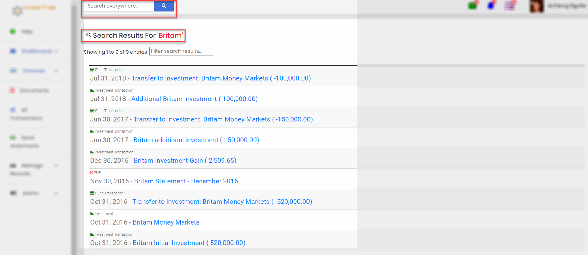

#### **Mobile**
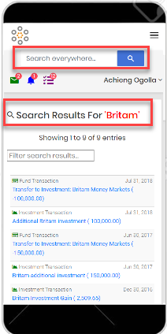
<!-- tabs:end -->
When searching through application, the content will be displayed according to the logged in user’s access to the content that matches the search string submitted.

>Therefore:
-	A member can only view their individual transactions with the exception of company expenses and documents which are transparent to all members.
-	A committee member can view all member transactions but not edit any of the transactions
-	The treasurer or admin can view, edit or delete all transactions

## Messages Icon
This icon links to the messages module which provides members with the ability to send messages to each other.

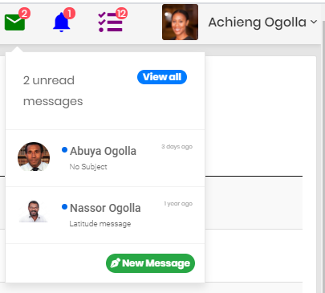

Clicking on the `See All Messages` link takes you to the Mailbox view from where a user can view all messages that they have received (in the Inbox Folder), sent (in the Sent Folder) or saved as a draft (in the Drafts Folder).

Clicking on the `Create Message` takes you to the `Compose New Message` view that allows you to compose and send a message to another member on the site. You can also compose a new message by using the `Compose` button at the top of the messages screen.

<!-- tabs:start -->
#### **Desktop**

#### **Mobile**
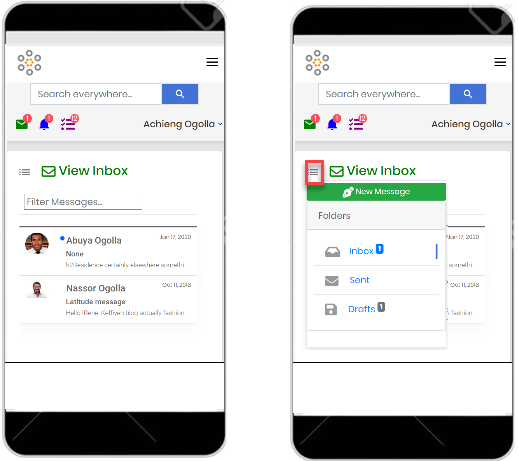
<!-- tabs:end -->

?> **Note** Messages sent to a member in the application will also be `sent as an external email` to the recipient.

##	Announcements
This icon links to the announcement module where members can view announcements sent by the administrator of the website.

Clicking on the `View All Announcements` button takes you to the `Announcements` screen from where a member can view all announcements.

?> **Note** Announcements are also sent to the members as external emails.

<!-- tabs:start -->
#### **Desktop**

#### **Mobile**
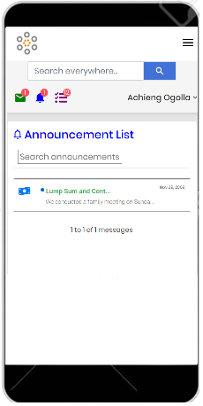
<!-- tabs:end -->

## User Drop Down
The User Drop-down Icon provides the members with access to their profile, ability to reset their password or to log out from the site

## Member Profile
The Profile page allows the user to view and setup their personal details. To access the profile page, click the Profile button from the drop-down list under you name.

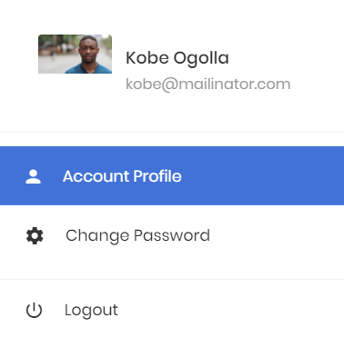

The full profile page appears as shown below.
<!-- tabs:start -->
#### **Desktop**
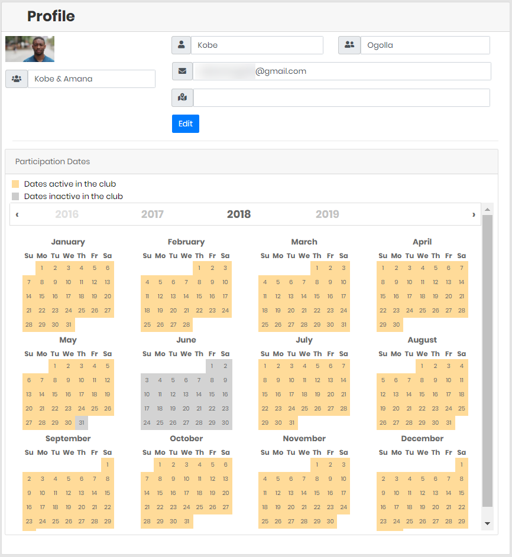

#### **Mobile**
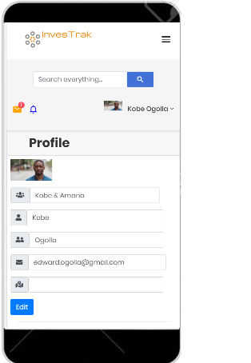
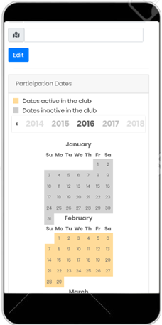

<!-- tabs:end -->
Detail on the profile page include
- `Image` – Image file to display members image
-	`Account` – Account to which the member belongs. This allows more than one individual to be part of the account
-	`First Name` – Member’s Given Name(s)
-	`Last Name` – Members Last name
-	`E-mail` – Email address. This is also used as the login ID
-	`Address` – Physical address or P. O. Box that member can be reached at.
-	`Participation dates` -  a calendar grid that keeps track of the time ranges for which a member is part of the fund.

!> **Note** It is important that the treasurer accurately records your `Participation Dates` so that arrears and dues can be calculated correctly.

## Change password
To change password, click the Password button from the drop-down list under you name.

|  Change Password Option             | Steps |
  :-------------------------:|:-------------------------:
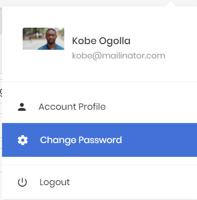|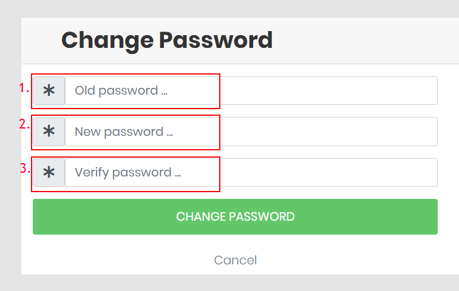

  1. Enter your old password
  1. Enter the new password
  1. Enter your new password again to verify

## Log out
Clicking on this button logs the member out of the website

|  Log out             | Confirmation |
  :-------------------------:|:-------------------------:
|

You should see a pop-up indicating that you have successfully `logged out` and the screen should display a prompt for log in credentials.
